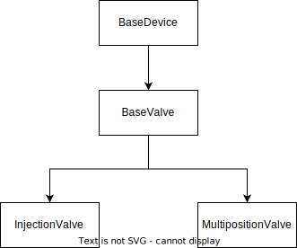

# Models

Each device object must be subclass of `BaseDevice`, either directly or more likely via one of `BaseDevice` subclasses.
This allows to add features to all device objects ensuring consistency and without repeating code
(i.e. following the [DRY](https://en.wikipedia.org/wiki/Don%27t_repeat_yourself) principle).
For example, the attribute `owl_subclass_of`, defined in `BaseDevice`, allows to specify classes of the Web Ontology
Language.

The scheme below represents the current device object taxonomy.




```{toctree}
:maxdepth: 2

valves/base_valve
valves/injection_valve
valves/multiposition_valve

```
