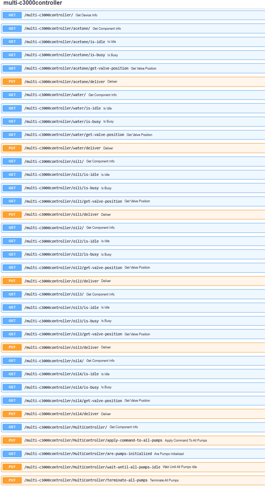

# Adding a New Device as an External Plugin

Flowchem supports external plugins, allowing users to create local packages that extend its functionalities. This 
approach offers several advantages, such as maintaining full control over device-specific code. However, it introduces 
additional complexity and is recommended only for experienced Python developers.

Flowchem uses Python [entry points](https://packaging.python.org/en/latest/specifications/entry-points/) 
to automatically discover installed plugins. To be recognized by Flowchem, any new 
plugin must register an entry point under the flowchem.devices group.

## Getting Started

You can start by forking the `flowchem-test` repository, which provides a template for a Flowchem plugin.
Configuration with pyproject.toml

If you are using a pyproject.toml file, the configuration should look something like this:

```toml
[project.entry-points."flowchem.devices"]
test-device = "flowchem_test:fakedevice"
```

## Example: Integrating a Real Device Library

Let's walk through an example of integrating an existing library into Flowchem. We will use the 
[pycont](https://github.com/croningp/pycont) library, developed to control Tricontinent C3000 pumps. 

The `pycont` package contains two main classes, defined in 
[controller.py](https://github.com/croningp/pycont/blob/master/pycont/controller.py#L338):

* `VirtualC3000Controller`: Handles communication with individual pumps.

* `MultiPumpController`: Manages multiple pumps simultaneously.

To integrate this library into Flowchem, follow these steps:

### Step 1: Fork the library 

Fork the `pycont` repository so you can modify it to fit the Flowchem plugin architecture.

### Step 2: Add an Entry Point

Add an entry point to the `setup.py` file to make Flowchem recognize the device:

```python
from setuptools import find_packages, setup

VERSION = '1.0.2'

setup(
    name="pycont",
    version=VERSION,
    description="Tools to work with Tricontinental Pumps",
    author="Jonathan Grizou",
    author_email='jonathan.grizou@glasgow.ac.uk',
    packages=find_packages(),
    package_data={
        "pycont": ["py.typed"]
    },
    include_package_data=True,
    install_requires=['pyserial'],
    entry_points={
        "flowchem.devices": [
            "multi-c3000controller = pycont._flowchem_plugin"
        ],
    },
)
```
[!NOTE]
Your fork of the `pycont` package must be installed in the same environment where flowchem is installed.

### Step 3: Create a Flowchem-Compatible Plugin Module

Next, create a module that contains two classes to integrate with Flowchem. The classes are structured to adapt the 
original library`s methods to work within Flowchem's asynchronous framework.

Create the plugin module file `_flowchem_plugin.py` inside the `pycont` directory, as specified in the entry point.

#### Example: Plugin Module

```python
from flowchem.components.flowchem_component import FlowchemComponent
from flowchem.devices.flowchem_device import DeviceInfo, FlowchemDevice

from pycont.controller import VirtualC3000Controller, VirtualMultiPumpController


class APIMultiPumpController(FlowchemDevice):
    """
    FlowchemDevice interface for controlling multiple Tricontinental C3000 pumps via pycont.

    This class serves as a bridge between Flowchem and the `VirtualMultiPumpController`
    from the pycont library. It initializes the pump controller and registers pump components.

    Attributes:
        device_info (DeviceInfo): Metadata about the device, such as manufacturer, model, and version.
        configuration (str): Path to a JSON config file that describes the hardware setup.
        controller (VirtualMultiPumpController): Internal controller object from pycont for low-level access.
    """

    device_info = DeviceInfo(
        manufacturer="virtual-device",
        model="FakeDevice",
        serial_number=42,
        version="v1.0",
    )

    def __init__(self, name: str, configuration: str):
        """
        Initialize the API controller with a configuration file (detail in pycont documentation).

        Args:
            name (str): Name of the device instance within Flowchem.
            configuration (str): Path to a JSON config file used to initialize the hardware.
        """
        super().__init__(name)
        self.configuration = configuration
        self.controller: VirtualMultiPumpController | None = None

    async def initialize(self):
        """
        Asynchronously initialize the pump controller and register individual pump components.

        This method is called automatically by Flowchem when the server starts. It parses
        the configuration file and registers each pump and the multi-pump manager as components.
        """
        self.controller = VirtualMultiPumpController.from_configfile(self.configuration)
        
        # Register each individual pump as a FlowchemComponent
        for name in self.controller.pumps.keys():
            self.components.append(PumpComponent(name=name, hw_device=self))
        
        # Register the multi-pump controller component (used for global commands)
        self.components.append(MultiPumpComponent(name="MultiController", hw_device=self))


class PumpComponent(FlowchemComponent):
    """
    Represents a single C3000 pump as a FlowchemComponent.

    This class exposes individual pump operations (e.g., deliver, status checks) as REST API endpoints.

    Attributes:
        hw_device (APIMultiPumpController): Parent device managing the pump controller.
        pump (VirtualC3000Controller): Reference to the low-level pump object from pycont.
    """
    hw_device: APIMultiPumpController

    def __init__(self, name: str, hw_device: APIMultiPumpController):
        """
        Initialize the component and register API routes for pump operations.

        Args:
            name (str): Name of this pump (e.g., "P1").
            hw_device (APIMultiPumpController): The hardware device managing this component.
        """
        super().__init__(name, hw_device)
        self.pump: VirtualC3000Controller = self.hw_device.controller.pumps[name]

        # Register REST endpoints for controlling the pump
        self.add_api_route("/is-idle", self.is_idle, methods=["GET"])
        self.add_api_route("/is-busy", self.is_busy, methods=["GET"])
        self.add_api_route("/get-valve-position", self.get_valve_position, methods=["GET"])
        self.add_api_route("/deliver", self.deliver, methods=["PUT"])

    async def is_idle(self):
        """
        Check if the pump is currently idle.

        Returns:
            bool: True if the pump is idle and ready for a new operation.
        """
        return self.pump.is_idle()

    async def is_busy(self):
        """
        Check if the pump is currently executing a command.

        Returns:
            bool: True if the pump is busy (e.g., delivering or moving valves).
        """
        return self.pump.is_busy()

    async def get_valve_position(self):
        """
        Get the current valve position of the pump.

        Returns:
            str: The valve position label (e.g., "A", "B").
        """
        return self.pump.get_valve_position()

    async def deliver(self, volume_in_ml: float, to_valve: str | None = None, speed_out: int | None = None, 
                      wait: bool = False, secure: bool = True):
        """
        Instruct the pump to deliver a specific volume to a given valve port.

        Args:
            volume_in_ml (float): Volume to deliver in milliliters.
            to_valve (str, optional): Valve port to deliver to (e.g., "A").
            speed_out (int, optional): Speed of delivery.
            wait (bool): Whether to wait for delivery to complete.
            secure (bool): If True, use safety checks before delivery.

        Returns:
            Any: The result of the delivery operation from pycont.
        """
        return self.pump.deliver(volume_in_ml, to_valve, speed_out, wait, secure)


class MultiPumpComponent(FlowchemComponent):
    """
    Represents the multi-pump controller as a FlowchemComponent.

    This component exposes commands that operate across all pumps simultaneously,
    such as broadcasting commands, checking initialization, and termination.

    Attributes:
        hw_device (APIMultiPumpController): Reference to the parent multi-pump controller device.
    """
    hw_device: APIMultiPumpController

    def __init__(self, name: str, hw_device: APIMultiPumpController):
        """
        Initialize the multi-pump component and register REST endpoints.

        Args:
            name (str): Name of the multi-pump component (e.g., "MultiController").
            hw_device (APIMultiPumpController): The parent device controlling all pumps.
        """
        super().__init__(name, hw_device)

        # Register REST API endpoints for global pump actions
        self.add_api_route("/apply-command-to-all-pumps", self.apply_command_to_all_pumps, methods=["PUT"])
        self.add_api_route("/are-pumps-initialized", self.are_pumps_initialized, methods=["GET"])
        self.add_api_route("/wait-until-all-pumps-idle", self.wait_until_all_pumps_idle, methods=["PUT"])
        self.add_api_route("/terminate-all-pumps", self.terminate_all_pumps, methods=["PUT"])

    async def apply_command_to_all_pumps(self, command: str, *args, **kwargs):
        """
        Apply a raw command (as a string) to all pumps in the controller.

        Args:
            command (str): Command name.
            *args: Positional arguments for the command.
            **kwargs: Keyword arguments for the command.

        Returns:
            Any: Result of the batch command execution.
        """
        return self.hw_device.controller.apply_command_to_all_pumps(command, *args, **kwargs)

    async def are_pumps_initialized(self) -> bool:
        """
        Check whether all pumps have been properly initialized.

        Returns:
            bool: True if all pumps are initialized.
        """
        return self.hw_device.controller.are_pumps_initialized()

    async def wait_until_all_pumps_idle(self):
        """
        Block execution until all pumps report they are idle.
        """
        return self.hw_device.controller.wait_until_all_pumps_idle()

    async def terminate_all_pumps(self):
        """
        Gracefully shut down all pump controllers and terminate communication.

        Useful for clean application shutdown or hardware reset.
        """
        return self.hw_device.controller.terminate_all_pumps()

from flowchem.components.pumps.pump import Pump
```
[!NOTE]
You can also inherit from an existing component in `flowchem.components` instead of the base `FlowchemComponent`.
For example, instead of inheriting directly from `FlowchemComponent`, you may inherit from a specialized class such as 
Pump located in `flowchem.components.pumps.pump`.
This approach allows you to reuse predefined API endpoints and behavior, saving development time. However, 
it’s important to ensure that your device's methods match the expected interface (ontology) of the inherited component. 
You must adapt your implementation accordingly.
If the mapping between your device and the inherited component is not straightforward, **we do not recommend** this
approach, as it can lead to confusion and broken API behavior.

For example:
```python
...

from flowchem.components.pumps.pump import Pump

...

class PumpComponent(Pump):
    
    # This method corresponds to an expected API endpoint
    async def infuse(self, rate: str = "", volume: str = "") -> bool: 
        """Start infusion."""
        # Translate this high-level call from API-end point into a command for VirtualMultiPumpController
        ...

```

[!NOTE]
For more information on why you need to import FlowchemComponent and FlowchemDevice, refer to the guide on
[how to add new devices (straight approach)](add_to_flowchem.md).

[!NOTE]
For detailed documentation on device behavior and communication, visit the `pycont` 
[documentation](https://github.com/croningp/pycont/blob/master/README.md).

### Step 4: Add Configuration

Finally, create a configuration file that specifies the device initialization.

Example configuration (config.toml):

```toml
[device.multi-c3000controller]
type = "APIMultiPumpController"
configuration = ".../pycont/tests/pump_multihub_config.json" # Path to the configuration file. See the pycont repo for more details.
```

## Result

By following these steps, the capabilities of your devices will be automatically exposed through the Flowchem server,
similar to the native devices already present in Flowchem.

