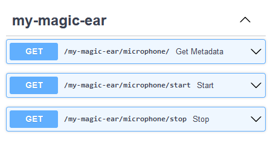
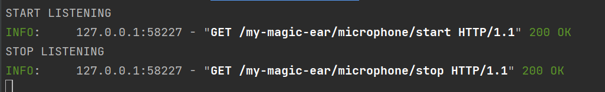

# Add new device to flowchem

## Code
### Folder hierarchy
In the `flowchem.device` subpackage, the device modules are organized in folders by manufacturer.
Since this is the first device from _Weasley & Weasley_ in flowchem, we need to create a new folder called
`/flowchem/devices/weasley`.

Folders and modules should have short, all-lowercase names. Underscores can be used in the module name if it improves 
readability, in line with [PEP8](https://peps.python.org/pep-0008/).

### Module name
In this folder we will create a _module_ (i.e. a python file 🐍) called `extendable_ear.py` with an `ExtendeableEar`
class to control our magic device.
```python
class ExtendableEar:
    """Our virtual Extendable Ear!"""
    ...
```

### FlowchemDevice subclass
To signal flowchem that this class can be used to instantiate object specified in the device configuration we need to do
two things:
* inherit from `FlowchemDevice`
* expose it in `flowchem.devices`

For the first thing it is enough to change our class as follows:
```python
from flowchem.devices.flowchem_device import FlowchemDevice


class ExtendableEar(FlowchemDevice):
    """Our virtual Extendable Ear!"""
    ...
```
For the second thing we need to update the `__init__.py` file in `/flowchem/devices` to import `ExtendeableEar` there,
either directly like
```python
from .weasley.extendable_ear.py import ExtendableEar
```
 or by making an intermediate `/flowchem/devices/weasley/__init__.py` file like
```python
"""Weasley devices."""
from .extendable_ear import ExtendableEar

__all__ = ["ExtendableEar"]
```
and correspondingly in the `/flowchem/devices/__init__.py` file.
```python
from .weasley import *
```

### Device configuration
Additional parameters needed for the device setup can be specified in the device classes `__init__` method, if a default is provided
the parameter will also be optional in the device section in the configuration file.
In our case, the ExtendableEar has an optional length parameter, with a default value of "10 cm".
To prevent ambiguities, all amounts with units should be provided as strings and parsed by the pint UnitRegistry
`flowchem.ureg`.
```python
from flowchem.devices.flowchem_device import FlowchemDevice
from flowchem import ureg


class ExtendableEar(FlowchemDevice):
    """Our virtual Extendable Ear!"""

    def __init__(self, length="10 cm", name=""):
        super().__init__(name)
        self._length = ureg(length)
```

If some input/output operation is needed to initiate communication with the device, and the relevant code involves
async calls, the `initialize()` coroutine can be used that is automatically called by flowchem after device
initialization.
```python
from flowchem.devices.flowchem_device import FlowchemDevice
from flowchem import ureg
from loguru import logger

class ExtendableEar(FlowchemDevice):
    """Our virtual Extendable Ear!"""

    def __init__(self):
        ...

    async def initialize(self):
        logger.info('ExtendableEar was successfully initialized!')
```
Entering information points is recommended to detect possible errors during device initialization. You are advised to 
use the loguru package. For more details, visit [Loguru doc](https://loguru.readthedocs.io/en/stable/). Before run the program, the device class 
`ExtendableEar` must be initialized in the `__init__.py` of the device package for the flowchem to find it at the moment 
of the inspection. In the device folder `floechem.device.weasley.__init__`, create a file as described below:

```python
from .extendable_ear import ExtendableEar

__all__ = ["ExtendableEar"]
```

And at the __init__.py of the device package, include the initialization of the new one class:

```python
...
from .weasley import *
```

At this point we can create the configuration file to initialize our new device type. THis will check if everything is ok so far (it would not work otherwise).
Let's create a minimal config file name `ear.toml` with this content:
```toml
[device.my-magic-ear]
type = "ExtendableEar"
```
and let's run `flowchem` in debug mode with that configuration file:
```shell
flowchem -d ear.toml
```
:::{note}
You might need to reinstall flowchem from the repository you have introduced changes to with `pip install .`.
If you are developing new code, to avoid the need of re-installing the package after every change of the source code you
can install flowchem in [development mode](https://setuptools.pypa.io/en/latest/userguide/development_mode.html) with*
`pip install -e .` *and every change of the source will be reflected immediately.*
:::

As you can see, in the console output, our device was initialized but there is still no component associated with it, so
no commands are available through the server:
```shell
2022-11-25 09:40:58.915 | DEBUG    | flowchem.server.configuration_parser:parse_device:123 - Created device 'my-magic-ear' instance: ExtendeableEar
2022-11-25 09:40:58.930 | DEBUG    | flowchem.server.api_server:create_server_for_devices:78 - Got 0 components from my-magic-ear
```

### Add a component
While the object subclassing FlowchemDevice has the responsibility of communicating with the device, the commands that
are available for that device should be exposed through a list of components, that are subclasses of `FlowchemComponent`.
`FlowchemComponent` represents specific and abstract functionalities.
For example, a pump with an integrated pressure sensor serves two purposes: pumping and sensing; therefore it will expose
two components, one subclassing `BasePump` (directly or indirectly, e.g. `HPLCPump`, which subclasses `BasePump`) the other one subclassing `PressureSensor`.
The components define the API for a class of capabilities and ensure a uniform API between different devices with similar
functions.
This is a crucial aspect of flowchem, that allows the abstraction of the device controlling code from the actual hardware
that implements such commands.
For example, it should be possible to swap one model of syringe pump for another one without any change in the code by
simply updating the flowchem configuration file with the different device type.

You can have a look in `flowchem.components` to check which component types already exist. These can be reused for
the device you are adding support for.
Alternatively, you can check the code of a device with similar function.

In our case, the ExtendableEar is introducing a new capability that was not previously present in flowchem, so we will
need to create a new component type for it.
First we will create the abstract component that will be shared across all the devices with similar functions.
Let's call it `Microphone`.
The best place for it is in `flowchem.components.sensors`.

First we need to define a basic command structure that would be supported by all microphones.
For example, we can define three methods: one to start the recording, one to stop it.
The stop method will be responsible for returning the path of the file where the recording was saved.

```python
from flowchem.components.sensors.sensor import Sensor


class Microphone(Sensor):
    def __init__(self, name, hw_device):
        super().__init__(name, hw_device)
        self.add_api_route("/start", self.start, methods=["GET"])
        self.add_api_route("/stop", self.stop, methods=["GET"])

    async def start(self):
        ...

    async def stop(self):
        ...
```

Now we need to create an `ExtendableEarMicrophone` component, that is the specific object that will be returned by
`ExtendableEar.components()` and that specifies the API route for our device.

Let's start by creating a stub of the `extendable_ear_microphone.py` in the `weasley` folder:
```python
from flowchem.components.sensors.microphone import Microphone


class ExtendableEarMicrophone(Microphone):
    ...
```

Now we need to update the `ExtendableEar` code, so we add a `component` method that returns a tuple with our
`ExtendableEarMicrophone`. Note that self.components is of type `list` and an attribute inherited of the FlowchemDevice class. This 
attribute contains all components of one specific device that can be accessed in the API.

```python
...
from flowchem.devices.weasley.extendable_ear_microphone import ExtendableEarMicrophone
from flowchem.devices.flowchem_device import FlowchemDevice
from loguru import logger


class ExtendableEar(FlowchemDevice):
    def __init__(self, name):
        super().__init__(name)
        self.device_info.manufacturer = "Weasley & Weasley",
        self.device_info.model = "Extendable Ear"

    async def initialize(self):
        # Here are the commands to initialize the device, checking its connectivity and setting it to 
        # the default/initial configuration before use.
        self.send_command('Verify connectivity')
        self.components.extend([ExtendableEarMicrophone("microphone",self)])
        logger.info('ExtendableEar was successfully initialized!')

    def send_command(self, command):
        logger.info(command)  # This is in place of actual communication with the device
```

If we run `flowchem ear.toml` again, the server will start successfully and show the metadata info together with the
`start` and `stop` methods.



However, executing start and stop will not execute any code.
For that we need to add some code in out `ExtendableEarMicrophone` to transform these calls into actions.
For example:
```python
from flowchem.components.sensors.microphone import Microphone


class ExtendableEarMicrophone(Microphone):

    def start(self):
        self.hw_device.send_command("START LISTENING")

    def stop(self):
        self.hw_device.send_command("STOP LISTENING")

```

If we run `flowchem ear.toml` once again we can now see the code in `ExtendableEar` being executed when the API
is called.




Finally, if we want to support some additional feature off our device that go beyond those of the standard component,
we can do it in the device-specific code.
For example, we can add the methods `deploy` and `rewind` to our `ExtendableEarMicrophone` but we should not introduce
those in the base `Microphone` class as other microphones are unlikely to support these highly-specific commands.

To do so we can add the corresponding api route in the init method of the component as follows:


```python
from flowchem import ureg
from flowchem.components.sensors.microphone import Microphone
from flowchem.devices.flowchem_device import FlowchemDevice


class ExtendableEarMicrophone(Microphone):
    def __init__(self, name: str, hw_device: FlowchemDevice) -> None:
        super().__init__(name, hw_device)
        self.add_api_route("/deploy", self.deploy, methods=["PUT"])
        self.add_api_route("/rewind", self.rewind, methods=["GET"])

    def deploy(self, length: str = "1 m"):
        length_to_deploy = ureg(length)
        self.hw_device.send_command(f"DEPLOY {length_to_deploy.m_as('m')}")

    def rewind(self):
        self.hw_device.send_command("REWIND")
```

Note how the `deploy` method takes a length in natural language and converts it to meters via the unit registry before
sending the command to our magic device.

And that's it: congratulations! 🎉
You have added support for the ExtendableEar👂 in flowchem!

### Documentation and tests
To let other people know that this device is also supported now it would be a good idea to add it to the documentation.
Optionally, some tests for the device functions can be added to prevent regressions.
