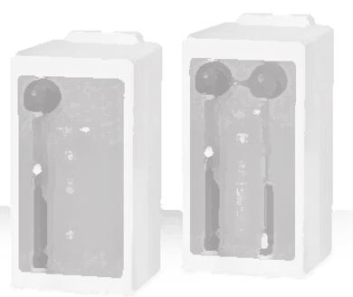
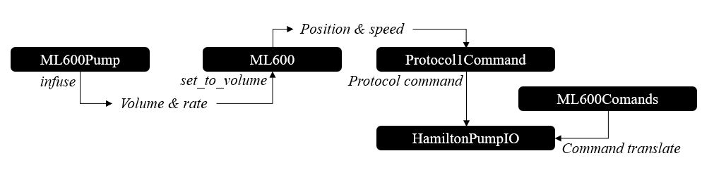

# Device Addition - Example Explained

This script guides the reader through the implementation of one of the device files in FlowChem.

To better understand how the package works, let's select a device consisiting of multiple components: the ML600.

The ML600 is a syringe pump developed by 
[Hamilton Company](https://www.hamiltoncompany.com/laboratory-products/microlab-600/stand-alone-syringe-pumps).

There are two models of these pumps, one with a single channel and one with two channels, as shown in the figure above:



As we can see, one channel consists of a valve connected to the outlet of the syringe. It means that this device has more than one 
component, i.e, valve and pump.

Let's start with the basics, as we learned in [add_new_device](add_to_flowchem.md).

First, we will create the script where the ML600's device class will be written. Let's call it `ml600.py`:

```python
from flowchem.components.device_info import DeviceInfo
from flowchem.devices.flowchem_device import FlowchemDevice
from flowchem.devices.hamilton.ml600_pump import ML600Pump              # Component - Pump
from flowchem.devices.hamilton.ml600_valve import ML600LeftValve        # Component - Valve


class ML600(FlowchemDevice):

    def __init__(
        self,
        name: str,
    ) -> None:
        
        super().__init__(name)
        
        self.device_info = DeviceInfo(
            manufacturer="Hamilton",
            model="ML600",
        )

    async def initialize(self):
        """Initialize pump and its components."""

        self.components.extend([ML600Pump("pump", self), ML600LeftValve("valve", self)])
```

We will write a new module in the same folder with the classes for each component. The pump component, for 
example, we have the `ml600_pump.py`.

```python
from flowchem.components.pumps.syringe_pump import SyringePump
from typing import TYPE_CHECKING
if TYPE_CHECKING:
    from .ml600 import ML600

class ML600Pump(SyringePump):
    
    pump_code: str
    hw_device: ML600  # for typing's sake

    def __init__(self, name: str, hw_device: ML600, pump_code: str = "") -> None:
        
        super().__init__(name, hw_device)

    @staticmethod
    def is_withdrawing_capable() -> bool:
        """
        Indicate that the ML600 pump can perform withdrawal operations.
        """
        return True

    async def is_pumping(self) -> bool:
        """
        Check if the pump is currently moving.

        Returns:
        --------
        bool
            True if the pump is moving or has commands in buffer, False if it's idle.
        """
        ...

    async def stop(self) -> bool:
        """
        Stop the pump's operation.

        Returns:
        --------
        bool
            True if the pump successfully stops, False otherwise.
        """
        ...

    async def infuse(self, rate: str = "", volume: str = "") -> bool:
        """
        Start an infusion with the given rate and volume.
        """
        ...

    async def withdraw(self, rate: str = "1 ml/min", volume: str | None = None) -> bool:
        """
        Start a withdrawal with the given rate and volume.
        """
        ...
```

Observe that the pump component of the device is a syringe pump, which means that we can inherit the functionality 
of the SyringePump class. We just need to overwrite the methods according to our specific connectivity commands from 
the device.

It is a good practice to access the methods of our main class, where the connectivity is built. For example:

```python
...
from flowchem import ureg    
...
class ML600Pump(SyringePump):
    def __init__(self, name: str, hw_device: ML600, pump_code: str = "") -> None:
        super().__init__(name, hw_device)
        self.pump_code = pump_code      
                                         
    async def is_pumping(self) -> bool:
        """ ... """
        return await self.hw_device.get_pump_status(self.pump_code)
    
    async def stop(self) -> bool:
        """ ... """
        await self.hw_device.stop(self.pump_code)
        return not await self.hw_device.get_pump_status(self.pump_code)
    
    async def infuse(self, rate: str = "", volume: str = "") -> bool:
        """ ... """
        current_volume = await self.hw_device.get_current_volume(self.pump_code)
        target_vol = current_volume - ureg.Quantity(volume)
        await self.hw_device.set_to_volume(target_vol, ureg.Quantity(rate), self.pump_code)
        return await self.hw_device.get_pump_status(self.pump_code)
    
    async def withdraw(self, rate: str = "1 ml/min", volume: str | None = None) -> bool:
        """ ... """
        current_volume = await self.hw_device.get_current_volume(self.pump_code)
        target_vol = current_volume + ureg.Quantity(volume)
        await self.hw_device.set_to_volume(target_vol, ureg.Quantity(rate), self.pump_code)
        return await self.hw_device.get_pump_status(self.pump_code)
```

```{note}
The `pump_code` attribute is specific for each device. It is used to identify a particular device, since to one serial port,
multiple devices can be connected in form of a daisy chain. This allows us to send commands to the correct device
```
The communication with the device happens inside the methods `get_pump_status`, `set_to_volume`, and `stop` of the `hw_device`. 
Remember that the `hw_device` is the ML600 main class.

Now, let`s come back to our main class. With a careful look at the device 
[manual](../../../user-guides/reference/devices/pumps/ml600.pdf) we will see how the commands should be written and 
sent through the serial. Based on this, we can write a data class to help us manage it all.

```python
import string
...
PUMP_ADDRESS = dict(enumerate(string.ascii_lowercase[:16], start=1))
...
@dataclass
class Protocol1Command:
    """Class representing a pump command and its expected reply."""

    command: str
    target_pump_num: int = 1
    target_component: str = ""
    command_value: str = ""
    optional_parameter: str = ""
    parameter_value: str = ""
    execution_command: str = "R"  # Execute

    def compile(self) -> str:
        """Create actual command byte by prepending pump address to command and appending executing command."""
        compiled_command = (
            f"{PUMP_ADDRESS[self.target_pump_num]}"
            f"{self.target_component}"
            f"{self.command}{self.command_value}"
        )

        if self.parameter_value:
            compiled_command += f"{self.optional_parameter}{self.parameter_value}"

        return compiled_command + self.execution_command
```

Introducing another crucial dataclass, essential for effectively managing the commands sent to the device:

```python
...
class ML600Commands(Enum):
    """ Just a collection of commands. Grouped here to ease future, unlikely, changes. """

    PAUSE = "K"
    RESUME = "$"
    CLEAR_BUFFER = "V"

    INIT_ALL = "X"
    INIT_VALVE_ONLY = "LX"
    INIT_SYRINGE_ONLY = "X1"

    # only works for pumps with two syringe drivers
    SET_VALVE_CONTINUOUS_DISPENSE = "LST19"
    SET_VALVE_DUAL_DILUTOR = "LST20"

    # if there are two drivers, both sides can be selected
    SELECT_LEFT = "B"
    SELECT_RIGHT = "C"

    # SYRINGE POSITION
    PICKUP = "P"
    DELIVER = "D"
    ABSOLUTE_MOVE = "M"

    # STATUS REQUEST
    # INFORMATION REQUEST -- these all returns Y/N/* where * means busy
    REQUEST_DONE = "F"
    SYRINGE_HAS_ERROR = "Z"
    VALVE_HAS_ERROR = "G"
    IS_SINGLE_SYRINGE = "H"
    # STATUS REQUEST  - these have complex responses, see relevant methods for details.
    STATUS_REQUEST = "E1"
    ERROR_REQUEST = "E2"
    TIMER_REQUEST = "E3"
    BUSY_STATUS = "T1"
    ERROR_STATUS = "T2"
    # PARAMETER REQUEST
    SYRINGE_DEFAULT_SPEED = "YQS"
      # 2-3692 seconds per stroke
    CURRENT_SYRINGE_POSITION = "YQP"  # 0-52800 steps
    SYRINGE_DEFAULT_BACKOFF = "YQB"  # 0-1000 steps
    CURRENT_VALVE_POSITION = "LQP"
      # 1-8 (see docs, Table 3.2.2
    GET_RETURN_STEPS = "YQN"  # 0-1000 steps
    # PARAMETER CHANGE
    SET_RETURN_STEPS = "YSN"  # 0-1000
    # VALVE REQUEST
    VALVE_ANGLE = "LQA"  # 0-359 degrees
    VALVE_CONFIGURATION = "YQS"
      # 11-20 (see docs, Table 3.2.2
    ...
```

And finally, a class to customize the serial communication, which is possible to control a series of devices 
through the same port:

```python
class HamiltonPumpIO:
    """Setup with serial parameters, low level IO."""

    ACKNOWLEDGE = chr(6)
    NEGATIVE_ACKNOWLEDGE = chr(21)
    DEFAULT_CONFIG = {
        "timeout": 0.1,
        "baudrate": 9600,
        "parity": aioserial.PARITY_ODD,
        "stopbits": aioserial.STOPBITS_ONE,
        "bytesize": aioserial.SEVENBITS,
    }

    def __init__(self, aio_port: aioserial.Serial) -> None:
        """Initialize serial port, not pumps."""
        self._serial = aio_port
        self.num_pump_connected: int | None = (
            None  # Set by `HamiltonPumpIO.initialize()`
        )
    ...

    async def _write_async(self, command: bytes):
        """Write a command to the pump."""
        await self._serial.write_async(command)

    async def _read_reply_async(self) -> str:
        """Read the pump reply from serial communication."""
        reply_string = await self._serial.readline_async()
        return reply_string.decode("ascii")

    async def write_and_read_reply_async(self, command: Protocol1Command) -> str:
        """Send a command to the pump, read the replies and returns it, optionally parsed."""
        self._serial.reset_input_buffer()
        await self._write_async(f"{command.compile()}\r".encode("ascii"))
        response = await self._read_reply_async()

        return self._parse_response(response)
```

The methods whiten in the component class to access the functionality of the device are built in the main class of 
the device:

```python
class ML600(FlowchemDevice):
    """..."""

    def __init__(
        self,
        pump_io: HamiltonPumpIO,
        syringe_volume: str,
        name: str,
        address: int = 1,
        **config,
    ) -> None:
        """..."""
        super().__init__(name)
        self.device_info = DeviceInfo(
            manufacturer="Hamilton",
            model="ML600",
        )
        # HamiltonPumpIO
        self.pump_io = pump_io
        ML600._io_instances.add(self.pump_io)  # See above for details.

        # Pump address is the pump sequence number if in chain. Count starts at 1, default.
        self.address = int(address)

        # Syringe pumps only perform linear movement, and the volume displaced is function of the syringe loaded.
        self.syringe_volume = ureg.Quantity(syringe_volume)


        self._steps_per_ml = ureg.Quantity(f"{48000 / self.syringe_volume} step")
        # self._offset_steps = 100  # Steps added to each absolute move command, to decrease wear and tear at volume = 0
        # self._max_vol = (48000 - self._offset_steps) * ureg.step / self._steps_per_ml
        self.return_steps = 24  # Steps added to each absolute move command (default)

        # This enables to configure on per-pump basis uncommon parameters
        self.config = ML600.DEFAULT_CONFIG | config
        self.dual_syringe = False

    @classmethod
    def from_config(cls, **config):
        """Create instances via config file."""
        # Many pump can be present on the same serial port with different addresses.
        # This shared list of HamiltonPumpIO objects allow shared state in a borg-inspired way, avoiding singletons
        # This is only relevant to programmatic instantiation, i.e. when from_config() is called per each pump from a
        # config file, as it is the case in the HTTP server.
        pumpio = None
        for obj in ML600._io_instances:
            # noinspection PyProtectedMember
            if obj._serial.port == config.get("port"):
                pumpio = obj
                break

        # If not existing serial object are available for the port provided, create a new one
        if pumpio is None:
            # Remove ML600-specific keys to only have HamiltonPumpIO's kwargs
            config_for_pumpio = {
                k: v
                for k, v in config.items()
                if k not in ("syringe_volume", "address", "name")
            }
            pumpio = HamiltonPumpIO.from_config(config_for_pumpio)

        return cls(
            pumpio,
            syringe_volume=config.get("syringe_volume", ""),
            address=config.get("address", 1),
            name=config.get("name", ""),
        )

    ...

   async def initialize(self, hw_init=False, init_speed: str = "200 sec / stroke"):
        """Initialize pump and its components."""
        # this command MUST be executed in the beginning
        await self.pump_io.initialize()
        await self.wait_until_system_idle()
        # Test connectivity by querying the pump's firmware version
        self.device_info.version = await self.version()
        logger.info(
            f"Connected to Hamilton ML600 {self.name} - FW version: {self.device_info.version}!",
        )
        self.dual_syringe = not await self.is_single_syringe()
        await self.general_status_info()

        # Add device components
        if self.dual_syringe:
            self.components.extend([ML600Pump("left_pump", self, "B"), ML600Pump("right_pump", self, "C"),
                                    ML600LeftValve("left_valve", self), ML600RightValve("right_valve", self)])
        else:
            self.components.extend([ML600Pump("pump", self), ML600LeftValve("valve", self)])

    async def send_command_and_read_reply(self, command: Protocol1Command) -> str:
        """Send a command to the pump. Here we just add the right pump number."""
        command.target_pump_num = self.address
        return await self.pump_io.write_and_read_reply_async(command)
    
    ...
    
    async def set_to_volume(self, target_volume: pint.Quantity, rate: pint.Quantity, pump: str):
        """Absolute move to target volume provided by set step position and speed."""
        speed = self._flowrate_to_seconds_per_stroke(rate)  # in seconds/stroke
        set_speed = self._validate_speed(speed)
        position = self._volume_to_step_position(target_volume)

        abs_move_cmd = Protocol1Command(
            command=ML600Commands.ABSOLUTE_MOVE.value,
            optional_parameter=ML600Commands.OPTIONAL_PARAMETER.value,
            command_value=str(position),
            parameter_value=set_speed,
            target_component=pump
        )
        return await self.send_command_and_read_reply(abs_move_cmd)

    async def pause(self, pump: str):
        """Pause any running command."""
        return await self.send_command_and_read_reply(
            Protocol1Command(command="", target_component=pump, execution_command="K"),)

    async def resume(self, pump: str):
        """Resume any paused command."""
        return await self.send_command_and_read_reply(
            Protocol1Command(command="", target_component=pump, execution_command="$"),)

    async def stop(self, pump: str) -> bool:
        """Stop and abort any running command."""
        await self.pause(pump)
        await self.send_command_and_read_reply(
            Protocol1Command(command="", target_component=pump, execution_command="V"),)
        return True

    async def get_pump_status(self, pump: str = "") -> bool:
        """Ture means pump is busy. False means pump is idle."""
        checking_mapping = {"B": 1, "C": 3}
        pump = "B" if not pump else pump
        status = await self.system_status(checking_mapping[pump])
        logger.info(f"pump {pump} is busy: {status}")
        return status

    async def system_status(self, component: int = -1) -> bool | dict[str: bool]:
        """
        Represent the status of specific component. True means busy; False meaens idle.
        Return status of all parts of instrument in dictionary.
        """
        reply = await self.send_command_and_read_reply(
                Protocol1Command(command="T1", execution_command=""))
        all_status = ''.join(format(byte, '08b') for byte in reply.encode('ascii'))[::-1]
        # 1 is true and 0 is false according to the manual; but the real signal is opposite.
        if -1 < component < 5:
            return all_status[component] == "0"

        value_map = {0: "left_valve busy", 1: "left_pump busy",
                     2: "right_valve busy", 3: "right_pump busy",
                     4: "step_active busy", 5: "handprobe_active busy"}
        status = {}
        for key in value_map:
            logger.debug(f"{value_map[key]} : {all_status[key] == '0'}")
            status[value_map[key]] = all_status[key] == "0"
        return status

   async def wait_until_system_idle(self):
        """Return when no more commands are present in the pump buffer."""
        logger.debug(f"ML600 {self.name} wait until idle...")
        while not await self.is_system_idle():
            await asyncio.sleep(0.1)
        logger.debug(f"...ML600 {self.name} idle now!")

    async def is_system_idle(self) -> bool:
        """Check if the pump is idle (actually check if the last command has ended)."""
        return (
            await self.send_command_and_read_reply(
                Protocol1Command(command="F", execution_command="")) == "Y"
        )

    async def is_single_syringe(self) -> bool:
        """Determine if single or dual syringe"""
        is_single = await self.send_command_and_read_reply(
            Protocol1Command(command="H", execution_command=""),
        )
        if is_single == "N":
            return False
        elif is_single == "Y":
            return True

    ...
```

The example above shows a draft of how flowchem devices can be implemented in the packaged. Another functionality 
related to the ML600LeftValve was added in a similar manner.

To better understand the information flow in this class, consider the scenario where an infuse command is sent to the 
pump, as illustrated below.



The command is then directed to the `set_to_volume` method in the `ML600` class. This command is translated into the 
speed and position of the syringe pump, which in turn creates a protocol with the `Protocol1Command` class. This 
protocol is then sent to the `HamiltonPumpIO`, where it is further translated according to the list of available 
commands as per the manual. Once translated, the command is sent to the pump through the serial port.

The all code implement to build the ml600 is seen [here](../../foundations/code_structure/flowchem.devices.hamilton.rst)


