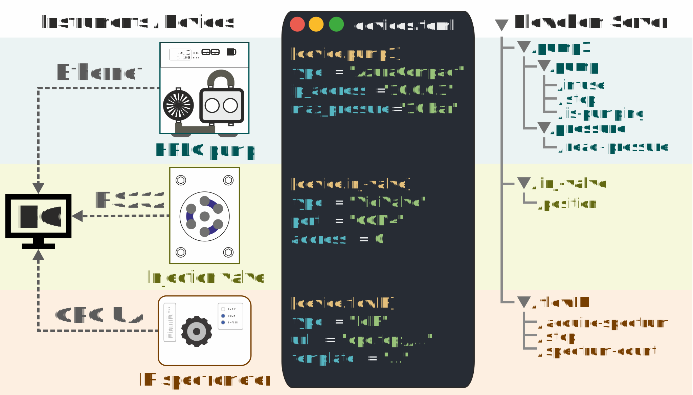

# Getting started
This guide will help you with the installation of flowchem.

## Overview
In a typical scenario, flowchem:
1. reads a configuration file listing the devices to be controlled and their settings;
2. creates connections with each device and ensures a reproducible state at start-up;
3. provides access to the capabilities of each device (such as pumping, heating etc...) via a web interface.

:::{figure-md} flowchem-architecture


**Figure 1** Schematic representation of flowchem software architecture.
An heterogeneous collection of devices is physically connected to a control PC.
The configuration file in TOML format specifies the connection parameters for each device.
After running flowchem with that configuration, a web server is started to control each device via a single API.
:::

### Interoperability
Since flowchem leverages web technologies, flowchem devices can be controlled directly with a web browser or by clients
written in different languages and from almost any operative system, including Android and iOS.
A set of python clients interfacing with the flowchem API are also provided and used in examples.

## Install flowchem
Flowchem requires a Python version of 3.10 or later.
You can get the latest version of Python from [python.org](https://www.python.org/downloads/).

To get started with flowchem run (preferably in a dedicated [virtual environment](https://peps.python.org/pep-0405/)):
```shell
pip install flowchem
```
or install it with [pipx](https://pypa.github.io/pipx/), a tool to install and run python applications in isolated
environments:
```shell
pip install pipx
pipx ensurepath
pipx install flowchem
```
<!--
The use of `pipx` is recommended because it:
* installs flowchem in a virtualenv, without interfering with other packages installed globally;
* ensure that the `flowchem` and `flowchem-autodiscover` commands are available system-wide, by adding the pipx binary
  folder to the system PATH (the `pipx ensurepath` step).-->

To verify the installation has been completed successfully you can run `flowchem --version`.

## Flowchem configuration
Flowchem needs a configuration file with the connection parameter of the device to be controlled.
In its simplest form, the configuration file looks like this:
```toml
[device.example1]
type = "FakeDevice"
```
Where `example1` is the device name and `FakeDevice` the device type.

### Running flowchem
Now create a file with that content (or get it from the [examples folder](https://github.com/cambiegroup/flowchem/tree/main/examples))
and run the `flowchem` command followed by the name of the file.
```shell
flowchem flowchem_config.toml
```

In your terminal, you will see some debug information, ending with a line like this one:
```shell
INFO:     Uvicorn running on http://127.0.0.1:8000 (Press CTRL+C to quit)
```

This means that the flowchem server has been started correctly.
You can visit [http://127.0.0.1:8000](http://127.0.0.1:8000) to see a list of commands available for your test device.

```{note}
The device name is used as first subdirectory in the URL of the commands relative to this device.
For example, in this case, the commands relative to our test device will be available under `http://localhost:8000/example1/`.
```
```{note}
For every request sent to the flowchem server, you will see some diagnostic output in the terminal.
While you can normally ignore this output, it can provide useful information in case of errors.
```

### Device autoconfiguration
To be able to write a configuration file, you need to know the type of device you want to connect to and some connection
parameters.

Flowchem is capable of auto-detecting some devices and instrument, and to generate a valid configuration stub for them.
To find any device already connected to the PC where flowchem is installed, run the autodiscover tool:
```shell
flowchem-autodiscover
```
And reply to the prompts.
If any device that supports autodiscovery is found, a `flowchem_config.toml` file will be created.


```{note}
Some additional information is generally still necessary even for auto-detected devices.
```


Complete the missing information (if any) in this file, and then you will be ready to use flowchem!

```{note}
`flowchem_config.toml` is written in [TOML format](https://en.wikipedia.org/wiki/TOML),
the syntax of this language is intuitive and designed to be human-editable.
If you follow this guide you will not need to learn anything about the TOML syntax, but you can just copy and modify the
examples provided.
```

:::{note}
Not all the devices supported by flowchem can be auto discovered, so you might need to edit the configuration
file manually for some device types.
:::

## Run flowchem
With flowchem installed and a configuration file created, you are ready to start your flowchem server.

Run `flowchem` followed by the location of the configuration file:
```shell
flowchem flowchem_config.toml
```

In your terminal, you will see some debug information, ending with a line like this one:
```shell
INFO:     Uvicorn running on http://127.0.0.1:8000 (Press CTRL+C to quit)
```

This means that the flowchem server has been started correctly.
You can visit [http://127.0.0.1:8000](http://127.0.0.1:8000) to see a list of commands available for the device you
configured.

For every request sent to the flowchem server, you will see some diagnostic output in the terminal.
While you can normally ignore this output, it can provide useful information in case of errors.
