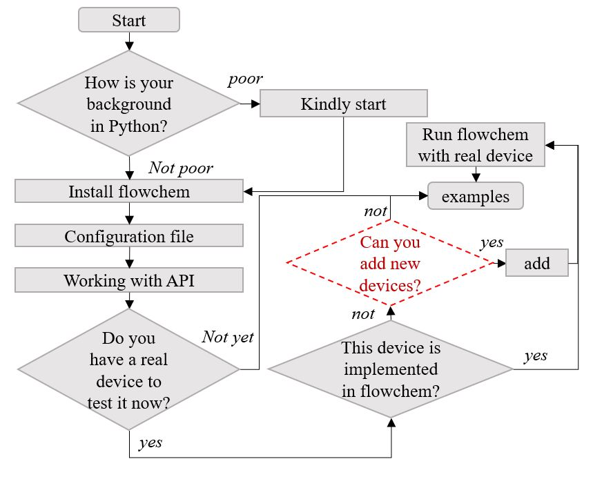

# Getting started

Flowchem's package assists the user in building the automation of your platform. Here, the 
platform is understandable as a conjunct of devices, generally of different suppliers, that must work synchronized to 
accomplish a task. In other words, to perform an experimental process automatically. 

If you're already familiar with the package or want to get straight to the point, just follow the instructions in this 
[ltdr](tldr.md).

:::{figure-md} flowchem-architecture

**Figure 1** Schematic representation of flowchem software architecture.
A heterogeneous collection of devices is physically connected to a control PC.
The configuration file in TOML format specifies the connection parameters for each device.
After running flowchem with that configuration, a web server is started to control each device via a single API.
:::

## Key features of the flowchem

1. **Easy configuration**

Flowchem was designed to use a simple, editable configuration file. This file contains the names of the devices 
connected to the computer and key details about each one, such as their connection addresses.

2. **Abstraction**

Flowchem was built using a class hierarchy for each component. Each device inherits common methods and attributes 
shared among similar devices. If needed, some devices can be easily replaced with an equivalent one without losing 
functionality. These equivalent devices can come from different suppliers but perform the same function, like two 
different pumps.

3. **Reproducible**

Flowchem creates connections with each device and ensures a reproducible state at start-up;

4. **Multithreading**

Flowchem provides access to the capabilities of each device (such as pumping, heating etc...) via a web interface.
Flowchem was developed to work with multithreading using the 
[Asynchronous package](https://docs.python.org/3/library/asyncio.html). This means commands can be sent 
asynchronously, and each device will run in its own thread. This setup helps prevent the entire system from crashing 
if an error occurs with one device.

5. **Interoperability**:

Since flowchem leverages web technologies, flowchem devices can be controlled directly with a web browser or by clients
written in different languages and from almost any operative system, including Android and iOS.
A set of python clients interfacing with the flowchem API are also provided and used in examples.

For direct immersion into the package, we recommend that the reader follow the flowchart presented below. The link to 
the documentation cited in the flowchart is listed below.

:::{figure-md} flowchart

**Figure 2** Flowchart with a suggested reading of the documentation 
:::

[Kindly start](user-guides/tutorials/start.md) - Friendly introduction to the flowchem;

[Install flowchem](user-guides/tutorials/installation.md) - How to install the flowchem;

[Configure the file](user-guides/How-ToGuide/configuration.md) - How to create a configuration file;

[Work with the API](user-guides/How-ToGuide/using_api.md) - How to work with the API server;

[Add new devices](development/additional/add_device/index.md) - How add new devices (to skilled people in the flowchem);

[Run flowchem with a real device](user-guides/How-ToGuide/realdevice.md) - Showcase with a real device;

[See a real example of usage](user-guides/examples/reaction_optimization.md) - Example where flowchem was 
applied.

Questions in flowchart:

1. **What is your background in Python?** To use this package, the user is not required to have a deep knowledge of 
   code programming. However, basic concepts are fundamental. If your coding background is poor, we kindly ask you to read and follow the instructions in the "[Kindly start](user-guides/tutorials/start.md)" section.

2. **Do you have a device to test it now?** You can test the flowchem on your device if it is plugged into your 
   computer. If you don't have a device to test, no worries. You can do it at another time.

4. If you have a device to test, **is this device implemented in flowchem?**. You can inspect this documentation to see 
   if your device is present in the [reference section](user-guides/reference/devices/supported_devices.md).

5. If your device is not implemented, **do you want to do it?**, be aware of some key points:
   - This documentation provides [guidance to implement new devices](development/additional/add_device/index.md), however, 
     it requires a certain level of knowledge in Python.
   - We recommend that before tackling this task, the user explores, reads, and understands the user guide section and 
   the [foundation of the package](development/foundations/foundation.md). We recommend the user to simply try the 
   package and follow provided material.
