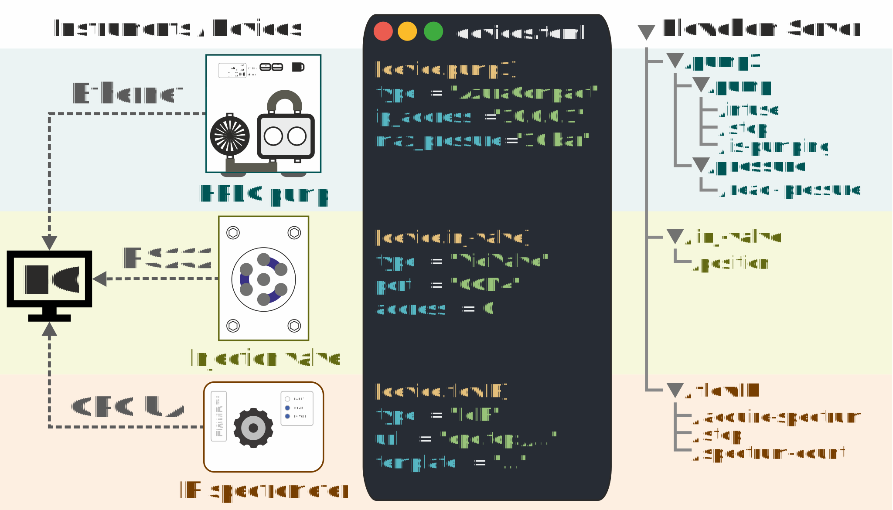

# Getting started
This guide will help you with the installation of flowchem.

## Overview
In a typical scenario, flowchem:
1. reads a configuration file listing the devices to be controlled and their settings;
2. creates connections with each device and ensures a reproducible state at start-up;
3. provides access to the capabilities of each device (such as pumping, heating etc...) via a web interface.

:::{figure-md} flowchem-architecture


**Figure 1** Schematic representation of flowchem software architecture.
A heterogeneous collection of devices is physically connected to a control PC.
The configuration file in TOML format specifies the connection parameters for each device.
After running flowchem with that configuration, a web server is started to control each device via a single API.
:::

### Interoperability
Since flowchem leverages web technologies, flowchem devices can be controlled directly with a web browser or by clients
written in different languages and from almost any operative system, including Android and iOS.
A set of python clients interfacing with the flowchem API are also provided and used in examples.

## Install flowchem
Flowchem requires a Python version of 3.10 or later.
You can get the latest version of Python from [python.org](https://www.python.org/downloads/).

To get started with flowchem run (preferably in a dedicated [virtual environment](https://peps.python.org/pep-0405/)):
```shell
pip install flowchem
```
or install it with [pipx](https://pypa.github.io/pipx/), a tool to install and run python applications in isolated
environments:
```shell
pip install pipx
pipx ensurepath
pipx install flowchem
```
<!--
The use of `pipx` is recommended because it:
* installs flowchem in a virtualenv, without interfering with other packages installed globally;
* ensure that the `flowchem` and `flowchem-autodiscover` commands are available system-wide, by adding the pipx binary
  folder to the system PATH (the `pipx ensurepath` step).-->

To verify the installation has been completed successfully you can run `flowchem --version`.

We recommend the user have an excellent immersion and introduction to the package to follow the following readings.

1. Read a friendly [introduction](./introduction.md) to learn why, when, and where to use the package. 
2. How do you [run](./running.md) the package using an example file configuration? 
3. Start to learn how the user can use the [API](./using_api.md).
4. Read an [exemple](../examples/index.md) case in which the package was applied. 