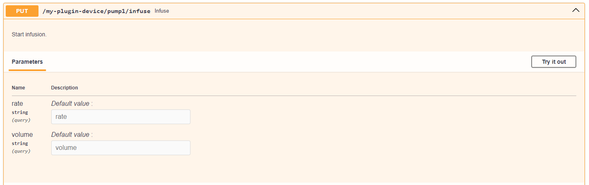

# Working with APIserver

After running the flowchem with a specific configuration file, an API is available on the server and can be accessed 
through the address: http://127.0.0.1:8000. Suppose we have a configuration file ***flowchem_config.toml*** as 
described below. My plugin is a generic device of the flowchem with the class name plugin.

```toml
[device.my-plugin-device]
type = "plugins"
```

The flowchem needs be running as shown:

```shell
flowchem flowchem_config.toml
```

The API available in the address will be:


Access to API can be done directly through the web browser or by clients written in different languages. Below, we 
show how easy it is to access API, for example, through Python. Access to API commands through Python files can be done
using the flowchem class.

## Acess the API through Python

```python
from flowchem.client.client import get_all_flowchem_devices
# Flowchem devices
flowchem_devices = get_all_flowchem_devices()
```
The variable ***flowchem_device*** in the code above is a dictionary with all devices connected through the API. With 
this variable, it is possible to access all components available in the device. In this example, the my-plugin-device
has four elements that can be accessed through the code below:

```python
pump1 = flowchem_devices['my-plugin-device'].Components['pump1']
pump2 = flowchem_devices['my-plugin-device'].Components['pump2']
pump3 = flowchem_devices['my-plugin-device'].Components['pump3']
valve = flowchem_devices['my-plugin-device'].Components['valve']
```

Each of these components represents one class. This class has methods that can be accessed through commands available 
in the API. For example, if you want to infuse a liquid using pump1, you can use, according to API interface, a method 
put as shown below:



The argument parameters to send these commands need to be specified in the method.

```python
pump1.put('infuse', params={'rate': "5 ul/min", 'volume': '1 ml'})
```

Therefore, creating a list of structures based on these components makes it possible to make the platform work 
automatically. We recommend writing the instructions in a standardized file, as shown below.

```python
# Important package to control the time
import time    
# Important class to monitor through a warning in the terminal the steps of the process.
# We recommend using as many of these packages as possible to identify which steps 
# are currently in your process and if there are any errors.
from loguru import logger
logger.add("./xp.log", level="INFO")
# Import all classes and protocols important for the automation.
from protocols import *

# Here, you can write down all initial configurations. 
...

# Run optimization for MAX_TIME
MAX_TIME = 60 * 60  # 1 hours, as a example
start_time = time.monotonic()

while time.monotonic() < (start_time + MAX_TIME):
    # Here, you can write down all instructions running in a loop until the 
    # MAX_TIME is achieved.
    ...
````

We recommend that the process's class of components and protocols (as a function) be written in another file 
***protocols.py***. It all can be imported into your main file, as shown before.

```python
from loguru import logger
from flowchem.client.client import get_all_flowchem_devices

flowchem_devices = get_all_flowchem_devices()

pump1 = flowchem_devices['my-plugin-device'].components['pump1']
pump2 = flowchem_devices['my-plugin-device'].components['pump2']
pump3 = flowchem_devices['my-plugin-device'].components['pump3']
valve = flowchem_devices['my-plugin-device'].components['valve']

# Process protocols
def calculate_flow_rates(*arg):
    ...

def set_parameters(*arg):
    ...
...
```

## Directly Access API

The user can also go through the request package to gain direct access to the commands available in Python.

```python
import requests

url = 'http://127.0.0.1:8000/my-plugin-device/pump1/'
data = response.json()
response = requests.get(url)
print(data)
```

Utilizing Visual Basic Applications, the API can be access, for example, using the ``WinHttp.WinHttpRequest.5.1``.

```VBA
Sub request()
    Dim LoginRequest As Object
    Set LoginRequest = CreateObject("WinHttp.WinHttpRequest.5.1")
    LoginRequest.Open "GET", "http://127.0.0.1:8000", False
    LoginRequest.setRequestHeader "Content-type", "/my-plugin-device/"
    LoginRequest.send ("pump1")
End Sub
```

Utilizing Java Script:

```java
import java.net.URI;
import java.net.http.HttpClient;
import java.net.http.HttpRequest;
import java.net.http.HttpResponse;

public class GetRequestExample {
    public static void main(String[] args) throws Exception {
        HttpClient client = HttpClient.newHttpClient();
        HttpRequest request = HttpRequest.newBuilder()
                .uri(new URI("http://127.0.0.1:8000/my-plugin-device/pump1/"))
                .build();

        HttpResponse<String> response = client.send(request, HttpResponse.BodyHandlers.ofString());
        System.out.println("Response: " + response.body());
    }
}
```

Utilizing R:

```R
library(httr)
library(jsonlite)

# Define the API endpoint
url <- "http://127.0.0.1:8000/my-plugin-device/pump1/"

# Make the GET request
response <- GET(url)
data <- fromJSON(content(response, "text", encoding = "UTF-8"))
print(data)
```

Utilizing C++:

```cpp
#include <iostream>
#include <curl/curl.h>
#include <nlohmann/json.hpp>

size_t WriteCallback(void* contents, size_t size, size_t nmemb, void* userp)
{
    ((std::string*)userp)->append((char*)contents, size * nmemb);
    return size * nmemb;
}

int main()
{
    CURL* curl;
    CURLcode res;
    std::string readBuffer;

    curl = curl_easy_init();
    if(curl) {
        curl_easy_setopt(curl, CURLOPT_URL, "http://127.0.0.1:8000/my-plugin-device/pump1/");
        curl_easy_setopt(curl, CURLOPT_WRITEFUNCTION, WriteCallback);
        curl_easy_setopt(curl, CURLOPT_WRITEDATA, &readBuffer);
        res = curl_easy_perform(curl);
        curl_easy_cleanup(curl);
        auto json_data = nlohmann::json::parse(readBuffer);
        std::cout << json_data.dump(4) << std::endl;
    }
    return 0;
}
```

This example showcases the versatility of the package across multiple coding languages.