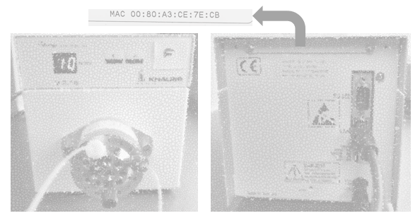

# Configuring and running a real device

Before proceeding with the instructions on how to set up and operate a real device, it's important to have a good
understanding of the configuration file and how to interact with the API server. While the 
"[How to create a configuration file](configuration.md)" and 
"[How to work with API](using_api.md)" 
sections illustrate these concepts using fake devices, the underlying principles remain the same when working with a 
real device.

For this showcase, we have selected the Knauer Valve. The settings, as documented in the 
[reference material](../reference/devices/valves/knauer_valve.md), are outlined in the following configuration file, 
named `config.toml`. 

```toml
[device.my-knauer-valve]  # This is the valve identifier
type = "KnauerValve"  # The actual valve type will be detected automatically
ip_address = "169.254.31.44"  # Onyl one of either ip_address or mac_address need to be provided
mac_address = "00:80:A3:B4:CE:77"  #  Onyl one of either ip_address or mac_address need to be provided
```

As specified in the settings for each parameter, only the IP address or MAC address needs to be provided.
The MAC address is provided on the device (see photo below). 

:::{figure-md} Device


**Figure 1** Knauer valve
:::

Therefore, simply configure the MAC address in the configuration.

```toml
[device.my-knauer-valve]
type = "KnauerValve"
mac_address = "00:80:A3:CE:7E:CB"
```

After running flowchem, the valve's functionalities will be accessible through the server. 


To access the valve directly in Python, simply use the get_all_devices function as described in item 
[tools](../tools.md).

