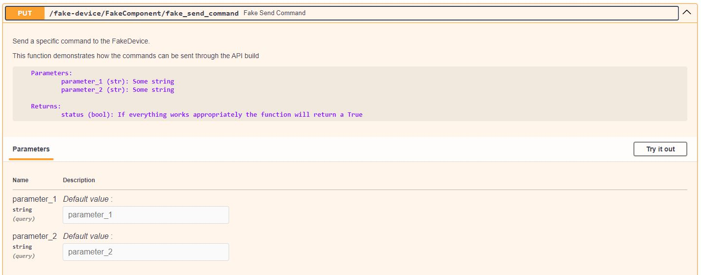

# Working with API server

After running the flowchem with a specific configuration file, a FastAPI server is available automatically and can be accessed 
through the address: http://127.0.0.1:8000. Suppose we have a configuration file `flowchem_config.toml` as 
described below. The device my-device is a generic device of flowchem with the class name FakeDevice.

```toml
[device.my-device]
type = "FakeDevice"
```

Run flowchem:
```shell
flowchem flowchem_config.toml
```

Another way to access this FakeDevice was implemented directly in the package commands. It can be access through:

```shell
flowchem example
```

This command accesses the `FakeDevice_configuration.toml` file that is available in the package folder in 
`flowchem/examples`.


The API available under the address will be:


Access to API can be done directly through the web browser or by clients written in different languages. Below, we 
show how easy it is to access the API, for example, through Python. Access to API commands through Python can be done
using the flowchem class.

## Access the API through Python

```python
from flowchem.client.client import get_all_flowchem_devices
# Flowchem devices
flowchem_devices = get_all_flowchem_devices()
```
The variable ***flowchem_devices*** in the code above is a dictionary with all devices connected through the API. With 
this variable, it is possible to access all components available from the devices. In this example, the my-device
has one component that can be accessed through the code below:

```python
from flowchem.client.client import get_all_flowchem_devices
# Flowchem devices
flowchem_devices = get_all_flowchem_devices()

component_fake = flowchem_devices['my-device']['FakeComponent']
```

This component represents one class. This class has methods that can be accessed through commands available 
in the API, see more details in [tools](../tools.md). For example, if you want to send a command to the component 
FakeComponent, you can use, according to API interface, a method put as shown below:



The argument parameters to send need to be specified in the method.

```python
from flowchem.client.client import get_all_flowchem_devices
# Flowchem devices
flowchem_devices = get_all_flowchem_devices()

component_fake = flowchem_devices['my-device']['FakeComponent']

component_fake.put('fake_send_command', params={'parameter_1': "something", 'parameter_2': 'something'})
```

When using either approach, whether using the API or get_all_flowchem_devices(), the same command is sent to the device.

## Directly Access API

The user can also go through the request package to gain direct access to the commands available in Python.

```python
import requests

url = 'http://127.0.0.1:8000/my-device/FakeComponent/'
response = requests.get(url)
data = response.json()
print(data)
```

## Using another code languages

Since the devices are available on a server, it is possible to access them using other means besides python.
This versatility allows the devices to be controlled using multiple coding languages.
