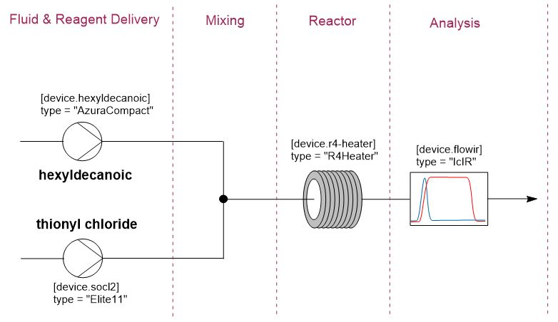

# Flowchem application example

This example demonstrated how to set up a process using flowchem. The process involved the reaction of two reagents, 
*hexyldecanoic acid* and *thionyl chloride*, inside a temperature-controlled reactor.

Four electronic devices were required for the setup. Two pumps were used to deliver the reagents: one from 
[AzuraCompact](../reference/devices/pumps/azura_compact.md), and the other from 
[Elite11](../reference/devices/pumps/elite11.md). A reactor from the R2 platform, equipped with temperature control,
was used; specifically, the [R4Heater](../reference/devices/technical/r4_heater.md) component. An infrared 
spectroscope from IR, [IcIR](../reference/devices/analytics/icir.md), was employed to analyze the product.

:::{figure-md} Synthesis


**Figure 1** Automatic synthesis
:::

This study aims to find the optimal operating conditions for three variables in order to maximize reaction yields. The 
variables are the temperature of the reactor, the residence time, and the molar ratio of the reagents. These optimal 
conditions were determined using a Bayesian optimization algorithm for continuous variables. The reaction yield was 
analyzed by integrating the peaks of the infrared spectrum.

```{note}
Although it was a specific application of flow chemistry, the file structure and orchestration built here can be used 
as a standard. This pattern can be used to build any process in the laboratory that includes the use of real-time 
optimization algorithms.
```

To gain a better understanding of the example, let's examine three different files that enabled the automation of the 
platform.

```bash
experiment_folder/
├── configuration_file.toml
├── main.py
└── run_experiment.py
```

##  Configuration File `configuration_file.py`

The configuration `configuration_file.toml` file used to address the devices of the platform is presented bellow.

```toml
[device.socl2]
type = "Elite11"
port = "COM4"
syringe_diameter = "14.567 mm"
syringe_volume = "10 ml"

[device.hexyldecanoic]
type = "AzuraCompact"
ip_address = "192.168.1.119"
max_pressure = "10 bar"

[device.r4-heater]
type = "R4Heater"
port = "COM1"

[device.flowir]
type = "IcIR"
url = "opc.tcp://localhost:62552/iCOpcUaServer"
template = "30sec_2days.iCIRTemplate"
```

##  Access the devices and important functions `run_experiment.py`

The electronic components used in the process were accessed from a Python script `run_experiment.py`. To access all 
devices listed in the configuration file, the command "get_all_flowchem_devices" was utilized. More information on how
this function operates can be found in the [tools section](../tools.md).

```python
import time
import numpy as np
import pandas as pd
from loguru import logger
from scipy import integrate

from flowchem.client.client import get_all_flowchem_devices
# Flowchem devices
flowchem_devices = get_all_flowchem_devices()

socl2 = flowchem_devices["socl2"]["pump"]
hexyldecanoic = flowchem_devices["hexyldecanoic"]["pump"]
reactor = flowchem_devices["r4-heater"]["reactor1"]
flowir = flowchem_devices["flowir"]["ir-control"]
```

Each component has its own GET and PUT methods. The commands are written based on available methods. 
When flowchem is running, you can easily see each device's available methods through the address 
[http://127.0.0.1:8000/docs](http://127.0.0.1:8000/docs). You can also find the methods in the 
[API documentation](../reference/api/index.md).

The file `run_experiment.py` has also a series of functions that is crucial to the experiment execution. Beyond of 
the `get_all_flowchem_devices` function, we needed to import some additional packages.

```python
import time                  # Manages delays.
import numpy as np           # Used for numerical operations (e.g., reading input data).
import pandas as pd          # Manipulates data in tabular form, like handling IR spectra.
from loguru import logger    # Logging library for better logging management.
from scipy import integrate  # Provides the trapezoid function, which is used to integrate the IR spectrum.
```

Bellow is listed the functions created to assist the experiment and was implemented in the `experimental_run.py`.

* Calculate the flow rates:

The total flow rate is directly calculate through the reactor volume and residence time:

$$Q_{total} = V_{reactor} / t_{residence}$$

The flow rate of hexyldecanoic was calculated through the expression:

$$Q_{hexyldecanoic} = \frac{Q_{total}MM_{socl_2}}{MM_{hexyldecanoic}r_{socl_2}+MM_{socl_2}}$$

In which the molar mass of the molecule of the molecule is represented for:

$$MM$$

And the the molar ration of the thionyl chloride in relation to hexyldecanoic:

$$r_{socl_2}$$

This function was implemented according to the script bellow:

```python
def calculate_flow_rates(SOCl2_equivalent: float, residence_time: float):
    """Calculate pump flow rate based on target residence time and SOCl2 equivalents.

    Stream A: hexyldecanoic acid ----|
                                     |----- REACTOR ---- IR ---- waste
    Stream B: thionyl chloride   ----|

    Args:
    ----
        SOCl2_equivalent:
        residence_time:

    Returns: dict with pump names and flow rate in ml/min

    """
    REACTOR_VOLUME = 10  # ml
    HEXYLDECANOIC_ACID = 1.374  # Molar
    SOCl2 = 13.768  # Molar

    total_flow_rate = REACTOR_VOLUME / residence_time  # ml/min

    return {
        "hexyldecanoic": (
            a := (total_flow_rate * SOCl2)
            / (HEXYLDECANOIC_ACID * SOCl2_equivalent + SOCl2)
        ),
        "socl2": total_flow_rate - a,
    }
```

* Sets the flow rates for the two pumps and the temperature for the reactor:

```python
def set_parameters(rates: dict, temperature: float):
    """Set flow rates and temperature to the reaction setup."""
    socl2.put("flow-rate", {"rate": f"{rates['socl2']} ml/min"})
    hexyldecanoic.put("flow-rate", {"rate": f"{rates['hexyldecanoic']} ml/min"})
    reactor.put("temperature", {"temperature": f"{temperature:.2f} °C"})
```

* Polls the reactor until the temperature stabilizes.

It checked a status flag ("target-reached") from the reactor and waited until it became `true`. This function was
crucial to ensure the reaction occurred at the specified temperature.

```python
def wait_stable_temperature():
    """Wait until a stable temperature has been reached."""
    logger.info("Waiting for the reactor temperature to stabilize")
    while True:
        if reactor.get("target-reached").text == "true":
            logger.info("Stable temperature reached!")
            break
        else:
            time.sleep(5)
```

* Waits for a new IR spectrum 

It checked the sample-count parameter and waited until a new sample was available.

```python
def _get_new_ir_spectrum(last_sample_id):
    while True:
        current_sample_id = int(flowir.get("sample-count").text)
        if current_sample_id > last_sample_id:
            break
        else:
            time.sleep(2)
    return current_sample_id
```

* Monitors the IR

This function continuously monitored the IR spectrum until changes between consecutive spectra were small enough 
(less than 0.2% difference). It integrated the peaks of the IR spectrum and compared them, looking for stability in 
the reaction. At the end, it returned the integrated peaks when the spectrum stabilized.

```python
def get_ir_once_stable():
    """Keep acquiring IR spectra until changes are small, then returns the spectrum."""
    logger.info("Waiting for the IR spectrum to be stable")

    # Wait for first spectrum to be available
    while flowir.get("sample-count").text == 0:
        time.sleep(1)

    # Get spectrum
    previous_spectrum = pd.read_json(flowir.get("sample/spectrum-treated").text)
    previous_spectrum = previous_spectrum.set_index("wavenumber")

    last_sample_id = int(flowir.get("sample-count").text)
    while True:
        current_sample_id = _get_new_ir_spectrum(last_sample_id)

        current_spectrum = pd.read_json(flowir.get("sample/spectrum-treated").text)
        current_spectrum = current_spectrum.set_index("wavenumber")

        previous_peaks = integrate_peaks(previous_spectrum)
        current_peaks = integrate_peaks(current_spectrum)

        delta_product_ratio = abs(current_peaks["product"] - previous_peaks["product"])
        logger.info(f"Current product ratio is {current_peaks['product']}")
        logger.debug(f"Delta product ratio is {delta_product_ratio}")

        if delta_product_ratio < 0.002:  # 0.2% error on ratio
            logger.info("IR spectrum stable!")
            return current_peaks

        previous_spectrum = current_spectrum
        last_sample_id = current_sample_id
```

* Integrates the spectrum


Integrated the areas of specific peaks from the IR spectrum within predefined wavenumber limits. The limits were read 
from a file called limits.in. Normalized the peak areas so that the sum of all areas equaled 1.

```python
def integrate_peaks(ir_spectrum):
    """Integrate areas from `limits.in` in the spectrum provided."""
    # List of peaks to be integrated
    peak_list = np.recfromtxt("limits.in", encoding="UTF-8")

    peaks = {}
    for name, start, end in peak_list:
        # This is a common mistake since wavenumbers are plot in reverse order
        if start > end:
            start, end = end, start

        df_view = ir_spectrum.loc[
            (start <= ir_spectrum.index) & (ir_spectrum.index <= end)
        ]
        peaks[name] = integrate.trapezoid(df_view["intensity"])
        logger.debug(f"Integral of {name} between {start} and {end} is {peaks[name]}")

    # Normalize integrals
    return {k: v / sum(peaks.values()) for k, v in peaks.items()}
```

* Function to orchestrates the experiment

Orchestrates an experiment by setting up flow rates, waiting for temperature stabilization, and monitoring the IR spectrum.
Steps:

1. Sets an initial low flow rate for standby.
2. Waits until the reactor reaches the target temperature.
3. Sets the actual flow rates based on the provided SOCl2 equivalents and residence time.
4. Waits for a duration equivalent to the residence time.
5. Monitors the IR spectrum until stability is reached.
6. Returns the ratio of the product peak in the IR spectrum.

```python
def run_experiment(
    SOCl2_equiv: float,
    temperature: float,
    residence_time: float,
) -> float:
    """Run one experiment with the provided conditions.

    Args:
    ----
        SOCl2_equivalent: SOCl2 to substrate ratio
        temperature: in Celsius
        residence_time: in minutes

    Returns: IR product area / (SM + product areas)

    """
    logger.info(
        f"Starting experiment with {SOCl2_equiv:.2f} eq SOCl2, {temperature:.1f} degC and {residence_time:.2f} min",
    )
    # Set stand-by flow-rate first
    set_parameters({"hexyldecanoic": "0.1 ml/min", "socl2": "10 ul/min"}, temperature)
    wait_stable_temperature()
    # Set actual flow rate once the set temperature has been reached
    pump_flow_rates = calculate_flow_rates(SOCl2_equiv, residence_time)
    set_parameters(pump_flow_rates, temperature)
    # Wait 1 residence time
    time.sleep(residence_time * 60)
    # Start monitoring IR
    peaks = get_ir_once_stable()

    return peaks["product"]
```

##  The optimization environment of the main file `main.py`

In the `main.py` script we start by importing the libraries needed to perform the automation:

* **time**: This package is used to read the current time and work with time management
* **gryffin**: Package used for optimization, more details in 
[Gryffin - Documentation](https://gryffin.readthedocs.io/en/latest/index.html)
* **loguru**: This package provides logging to the Python terminal and warns about errors, initialization, stage and 
end of the experiment.
* **run_experiment**: Import devices and the main function used in the experiment

```python
import time  
from gryffin import Gryffin
from loguru import logger
from run_experiment import run_experiment, reactor, flowir, hexyldecanoic, socl2
```

After we imported the essential packages, we initialized the hardware. Under the initial conditions, we would like to
have a ratio of 1 to 5 in the amount of thionyl chloride about hexadecanoic and a flow rate of 55 ul/min
(50 ul/min of hexadecanoic and 5 ul/min of thionyl chloride).

```python
# Heater to r.t.
reactor.put("temperature", params={"temperature": "21"})    # -> Observe how the methods PUT is used
reactor.put("power-on")

# Start pumps with low flow rate
socl2.put("flow-rate", params={"rate": "5 ul/min"})
socl2.put("infuse")

hexyldecanoic.put("flow-rate", params={"rate": "50 ul/min"})
hexyldecanoic.put("infuse")

# Ensure iCIR is running
assert (
    flowir.get("is-connected").text == "true"
), "iCIR app must be open on the control PC"
# If IR is running we can just reuse previous experiment. Because cleaning the probe for the BG is slow

status = flowir.get("probe-status").text
if status == " Not running":
    # Start acquisition
    xp = {
        "template": "30sec_2days.iCIRTemplate",
        "name": "hexyldecanoic acid chlorination - automated",
    }
    flowir.put("experiment/start", xp)
```

We also initialized the Loguru package to save the logs in a specific file. Finally, we initialized Gryffin. In 
Gryffin, we aimed to explore the space of three variables: the ratio of thionyl chloride, residence time in the 
reactor, and its temperature. Our objective was to achieve the maximum product ratio of IR. For more details on how 
Gryffin works, please access the [Gryffin - Start](https://gryffin.readthedocs.io/en/latest/getting_started.html).

```python
logger.add("./xp.log", level="INFO")

# load configuration before initializing the experiment
config = {
    "parameters": [
        {"name": "SOCl2_equivalent", "type": "continuous", "low": 1.0, "high": 1.5},
        {"name": "temperature", "type": "continuous", "low": 30, "high": 65},
        {"name": "residence_time", "type": "continuous", "low": 2, "high": 20},
    ],
    "objectives": [
        {"name": "product_ratio_IR", "goal": "max"},
    ],
}

# Initialize gryffin
gryffin = Gryffin(config_dict=config)
observations = []
```

After initializing the hardware, we started the experiment. Following 
[Gryffin's proposed structure](https://gryffin.readthedocs.io/en/latest/getting_started.html)
, the experiment ran in a loop. Within this loop, a series of conditions were analyzed and optimized using the 
optimization algorithm. We set a maximum time for the algorithm to search for the optimal condition.

```python
# Run optimization for MAX_TIME
MAX_TIME = 8 * 60 * 60
start_time = time.monotonic()

while time.monotonic() < (start_time + MAX_TIME):
    # query gryffin for new conditions_to_test, 1 exploration 1 exploitation (i.e. lambda 1 and -1)
    conditions_to_test = gryffin.recommend(
        observations=observations,
        num_batches=1,
        sampling_strategies=[-1, 1],
    )

    # evaluate the proposed parameters!
    for conditions in conditions_to_test:
        # Get this from your experiment!
        conditions["product_ratio_IR"] = run_experiment(**conditions)

        logger.info(f"Experiment ended: {conditions}")

    observations.extend(conditions_to_test)
    logger.info(observations)
```

## Reference additional

With these two files, it's possible to carry out a series of experiments in order to optimize the conditions. To see 
more detail on the synthesis, please go to 
[Continuous flow synthesis of the ionizable lipid ALC-0315](https://doi.org/10.1039/D3RE00630A). The complete files 
is available in [example folder](../../../examples/reaction_optimization).

<script
  src="https://cdn.mathjax.org/mathjax/latest/MathJax.js?config=TeX-AMS-MML_HTMLorMML"
  type="text/javascript">
</script>
