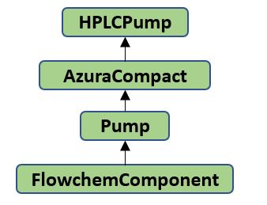

# Abstraction

FlowChem employs a high level of abstraction for devices through the use of 
[class and inheritance](https://pythonbasics.org/inheritance/). This approach allows the system to represent device 
components and build equipment efficiently. To illustrate, consider the table and figure below:

| Class of the System   | Description        | Main Function            |
|-----------------------|--------------------|--------------------------|
| Azura Compact Pump    | Specific Device    | Implement & run Commands |
| HPLC Pump             | Specific Component | Define Specific Commands |
| Pump                  | Base Component     | Define Base Commands     |
| FlowChem Component    | Base Class         | Base Constructor         |

## How Inheritance Works in FlowChem

When creating a class to represent a device, such as the ***Azura Compact Pump***, it inherits attributes and methods 
from the ***HPLC Pump*** class. The ***HPLC Pump*** class provides standard commands specific to its category of pumps.
This class, in turn, inherits from a more generic ***Pump*** class, which includes basic commands common to all pumps,
such as `activate` and `infuse`. Furthermore, the ***Pump*** class inherits from a base class that contains attributes
and methods applicable to all devices.

## Benefits of This Abstraction

1. **Ease of Device Switching**: Users can quickly switch between devices that share the same functions (i.e., inherit 
commands from the same parent class). This is possible even if the devices come from different suppliers or use different communication protocols.
2. **Minimal Code Changes**: Switching devices requires no changes to the existing code structure related to the 
platform's automation. The only change needed is in the configuration file, which is easily editable.
3. **Code Reusability**: By using inheritance, FlowChem avoids code duplication. Methods and attributes defined in a 
parent class are automatically available in all child classes, promoting the principle of "Don't Repeat Yourself" (DRY).

## Example

Consider the following hierarchy:

 

1. **FlowChem Component**: The base class for all devices.
2. **Pump**: Inherits from FlowChem Component, includes basic pump commands.
3. **HPLC Pump**: Inherits from Pump, includes specific commands for HPLC pumps.
4. **Azura Compact Pump**: Inherits from HPLC Pump, includes configuration for a specific device model.

This structure allows the ***Azura Compact Pump*** to utilize all the commands and attributes defined in its 
parent classes, ensuring consistent behavior and easy integration.

## Practical Impact

This level of abstraction ensures that users can manage and configure devices with minimal effort, focusing on 
high-level functionality rather than low-level implementation details. The configuration file, written in a simple 
and human-readable TOML format, allows users to make necessary changes quickly and efficiently.

Citations:
[1] https://pythonbasics.org/inheritance/