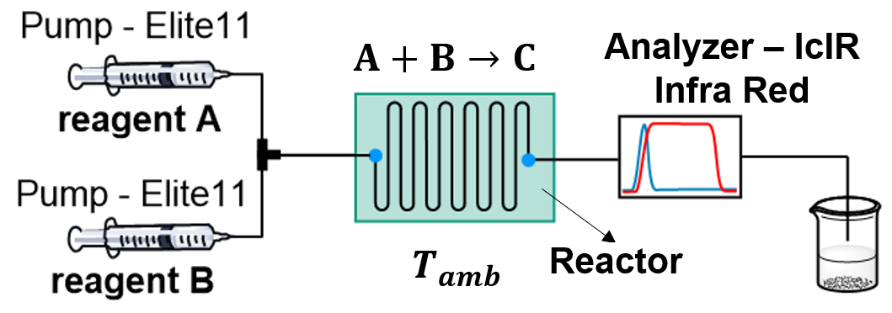

# Kindly start

## Fist steps

For a beginner in programming with no background in the area, a quick immersion in the package begins with a direct and
[straightforward introduction](https://medium.com/@katabathina44313/a-gentle-introduction-to-the-world-of-python-programming-eae2b4bc6fc6)
to Python and how to install it.

After installing Python, the user should install an IDE. An IDE (Integrated Development Environment) is a 
specialized text editor for coding. We recommend using PyCharm. To get a quick introduction to this IDE, 
we suggest reading the [Quick start guide](https://www.jetbrains.com/help/pycharm/quick-start-guide.html).


## Using flowchem

Diving into an example is the best way to understand the package's features. Let's say you are a chemist who wants to 
synthesize a molecule C, and to do so, two reagents, A and B, need to come into contact in a reactor. Take a look at 
the figure below that schematizes the platform. 

:::{figure-md} synthesis example


**Figure 1** Example of automatic synthesis
:::

You have three devices on this platform: two pumps and a sensor. To conduct the experiment, you need to activate the 
pump at a specific flow rate for a set duration, and then activate the sensor to analyze the product. 

And how do you do this? Well, the best approach is to have a drive to access the functionality of these devices in one 
platform. This task can be accomplished through flowchem.

Using flowchem, it is possible to access the devices' features on a **server** simply and 
directly. But what do this mean in practice?

Running on a server provides the platform with great versatility. For instance, the devices can be accessed by 
another computer on the same network.

In the previous example, to configure or inform flowchem about the devices you want to access, you just need to write a 
configuration file. The great thing is that this file is user-friendly, easily editable, and contains references to 
several devices implemented in flowchem. This means that the user only needs to consult the 
[reference documentation](../reference/devices/supported_devices.md)
of the device in flowchem to see how to configure it. In the example, we have two Elite11 pumps and one IcIR. 
According to the reference of the implemented devices, we can write the configuration file `configuration.toml` as follows:

```toml
[device.pump1]
type = "Elite11"
port = "COM4"
syringe_diameter = "14.567 mm"
syringe_volume = "10 ml"

[device.pump2]
type = "Elite11"
port = "COM1"
syringe_diameter = "14.567 mm"
syringe_volume = "10 ml"

[device.analyzer]
type = "IcIR"
url = "opc.tcp://localhost:62552/iCOpcUaServer"
template = "30sec_2days.iCIRTemplate"
```

Each instruction block in this file refers to a device. In this case, this file is just a copy and paste of what is in 
the [Elite11](../reference/devices/pumps/elite11.md) pump and [IcIR](../reference/devices/analytics/icir.md) analyzer 
references. 

After creating this configuration file, the user only needs to set the parameters for each device, such as 
the serial port to which the pump is plugged. And that's all. After running flowchem (look at the details of how to 
run it in [How-To Guide](../How-ToGuide/index.md) of the documentation), viewing the devices and accessing them on the 
server is possible. 

To do this, the user can access this functionality through the browser, see [access API](../How-ToGuide/using_api.md). 
And if you want to access it through Python, we suggest reading the tools available in the package.